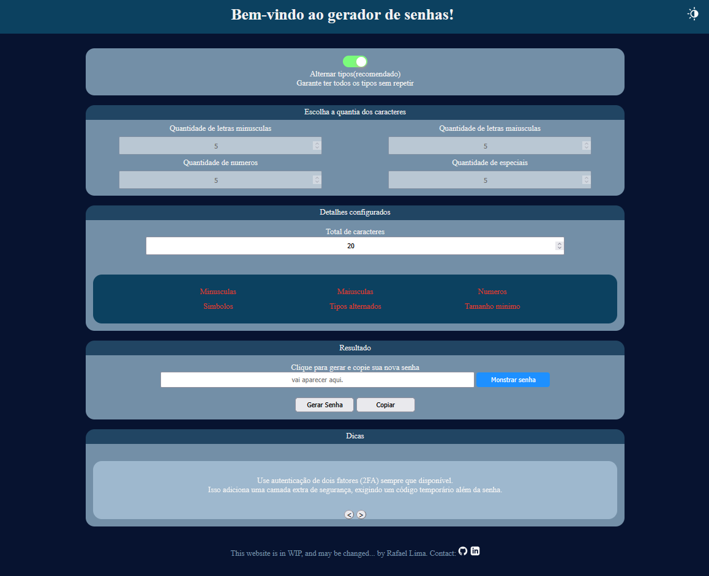

# 🔐 Gerador de Senhas

[🇺🇸 Read in English](README.en.md)

Um **gerador de senhas interativo** desenvolvido em **HTML, CSS e JavaScript**, com foco em personalização, segurança e uma interface moderna.  
O usuário pode configurar o tipo de caracteres, alternar temas (claro/escuro) e visualizar a força da senha em tempo real.

🌐 **Acesse o projeto online:**  
👉 [https://rafaellp96.github.io/Gerador-de-Senhas/](https://rafaellp96.github.io/Gerador-de-Senhas/)

---

## 🚀 Funcionalidades

- 🔄 Geração de senhas aleatórias com base em critérios definidos pelo usuário  
- 🎚️ Controle de quantidade de letras maiúsculas, minúsculas, números e caracteres especiais  
- 🌗 Alternância entre tema claro e escuro  
- 📊 Indicador de força da senha em tempo real  
- 📋 Botão para copiar a senha para a área de transferência  
- 🧭 Interface intuitiva e totalmente responsiva

---

## 🛠️ Tecnologias Utilizadas

| Tecnologia | Descrição |
|-------------|------------|
| **HTML5** | Estrutura e marcação semântica |
| **CSS3** | Estilização e temas dinâmicos |
| **JavaScript (ES6)** | Lógica de geração e interatividade |
| **GitHub Pages** | Hospedagem gratuita do projeto |
| **Visual Studio Code** | IDE para desenvolvimento |

---

## 🧠 Aprendizados

Durante o desenvolvimento deste projeto, exercitei:
- Modularização de código JavaScript com `export` e `import`
- Manipulação do DOM de forma dinâmica
- Uso de eventos e funções reutilizáveis
- Manipulação dinamica de string entre diferentes tipos de caracteres
- Estruturação de projeto para publicação no **GitHub Pages**

---

## 📸 Screenshot

---

## 🧑‍💻 Autor

**Rafael de Lima Pacheco**  
💼 Estudante de Análise e Desenvolvimento de Sistemas  
📍 Belo Horizonte - MG  
🔗 [LinkedIn](https://www.linkedin.com/in/rafaellp96)  
✉️ limafael@hotmail.com

---

## 📜 Licença

Este projeto está sob a licença MIT — sinta-se à vontade para usar e modificar.
